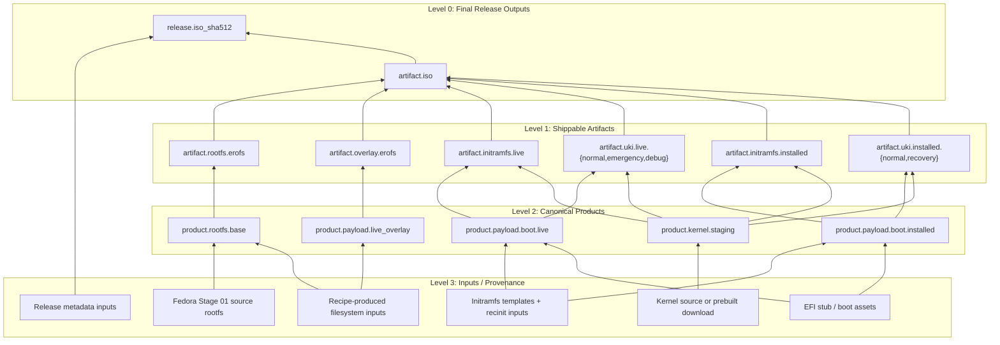

# 03 Filesystem-First Migration

Status: ready

## Purpose

Replace the current stage-numbered build model with a filesystem-first model.

The new canonical order is:

1. filesystem products
2. artifact transforms
3. release engineering
4. validation

The repo should stop treating stages as the architecture. Stages can remain as compatibility labels and test scenarios, but they should no longer be the canonical owners of composition.

## First-Principles Model

At the core, distro building is:

- collect files
- place files into the correct filesystem trees
- transform those trees into publishable artifacts
- verify the result

That means:

- the canonical build products are filesystem trees and derived filesystem images
- ISOs, disk images, UKIs, initramfs blobs, and release metadata are transforms of those products
- release engineering is the packaging/publishing layer on top, not the build model itself

## Recommended Dependency-Level Model

For clarity, the build graph should be explained with four visible levels.

- `Level 0`
  - final release outputs
- `Level 1`
  - shippable artifacts that directly make the final ISO
- `Level 2`
  - canonical composed products
- `Level 3`
  - acquired/generated inputs and provenance

This is a mental model for clarity, not a hardcoded implementation limit.
The real system is a dependency DAG, not a strict tree, and deeper inputs may
exist internally. But for planning and ownership, four visible levels are the
right default.

### Levitate Example

- `Level 0`
  - `artifact.iso`
  - `release.iso_sha512`
- `Level 1`
  - `artifact.rootfs.erofs`
  - `artifact.overlay.erofs`
  - `artifact.initramfs.live`
  - `artifact.uki.live.normal`
  - `artifact.uki.live.emergency`
  - `artifact.uki.live.debug`
  - `artifact.initramfs.installed`
  - `artifact.uki.installed.normal`
  - `artifact.uki.installed.recovery`
- `Level 2`
  - `product.rootfs.base`
  - `product.payload.live_overlay`
  - `product.payload.boot.live`
  - `product.payload.boot.installed`
  - `product.kernel.staging`
- `Level 3`
  - Fedora Stage 01 source rootfs
  - recipe-produced filesystem inputs
  - kernel source or prebuilt download
  - initramfs templates and recinit inputs
  - EFI stub and boot asset inputs
  - release metadata inputs

### Mermaid Graph

The key architectural rule is:

- levels describe dependency distance
- products own composition
- transforms own format conversion
- release outputs own publication metadata
- stage names, if kept, are compatibility or validation labels only

## What Release Engineering Means Here

Release engineering is **not** the whole distro builder.

It is the layer that:

- versions outputs
- names outputs
- computes hashes/manifests/signatures
- packages shipping artifacts
- publishes/promotes them

It should consume already-defined products. It should not be the place where core filesystem composition logic lives.

## Why This Track Exists

The current repo still mixes up three different things:

- composition units
- test milestones
- artifact owners

Stage numbers are currently used for all three, which is why the architecture feels wrong.

Examples of the current coupling:

- contracts are aggregated as `StageContract`
- builder workflows parse and route by stage numbers
- artifact directories and CLI commands are stage-owned
- install tests discover artifacts by stage path
- variant ownership still starts at `00Build.toml` and then fills later stages with placeholders

## What 03 Is

- a filesystem-product ownership migration
- an artifact-transform ownership migration
- a release-engineering boundary cleanup
- a test/scenario ownership migration

## What 03 Is Not

- not another Stage 01 source-media change
- not a bootc migration
- not a docs-only rename pass
- not "delete every stage module first"

## Current Repo Reality

The current stage model is still deeply real in active code:

- `distro-contract/src/schema.rs`
  - still defines `StageContract` as the aggregate contract owner
- `distro-contract/src/variant.rs`
  - still loads `00Build.toml` as the authoritative variant entrypoint and synthesizes later stage placeholders
- `distro-contract/src/validate.rs`
  - still validates the world as Stage 00-first, with deferred stage buckets
- `distro-builder/src/bin/workflows/parse.rs`
  - still parses `iso build <distro> <stage>`
- `distro-builder/src/bin/workflows/build.rs`
  - still builds by stage identity and stage roots
- `distro-builder/src/bin/workflows/artifacts.rs`
  - still prepares artifacts through `prepare-s00-build-inputs`, `prepare-s01-boot-inputs`, `prepare-s02-live-tools-inputs`
- `distro-builder/src/stages/s00_build.rs`
- `distro-builder/src/stages/s01_boot_inputs.rs`
- `distro-builder/src/stages/s02_live_tools_inputs.rs`
  - still encode composition as stage modules
- `distro-builder/src/pipeline/plan.rs`
  - already behaves somewhat like a producer system, but still emits stage-owned metadata
- `testing/install-tests/src/stages/mod.rs`
  - still runs and resolves artifacts through stage-numbered ownership
- `testing/install-tests/src/distro/*.rs`
  - still point at `s01-boot`, `s02-live-tools`, `s03-install`
- `xtask/src/cli/types.rs`
- `xtask/src/tasks/testing/stages.rs`
  - still expose stage-numbered boot/test workflow as the primary UX
- `justfile`
  - still teaches stage-numbered build/test routing

## Deep Investigation: Current Structural Blockers

The main blockers are not cosmetic. They are ownership bugs.

### 1. Stage is the canonical contract owner

- `distro-contract/src/schema.rs`
  - still defines `StageContract` as the real aggregate owner
  - still encodes artifact ownership through stage buckets
- `distro-contract/src/variant.rs`
  - still treats `00Build.toml` as the authoritative variant entrypoint
  - still synthesizes later-stage declarations with fake values such as `"ignored-in-stage_00-phase"`
- `distro-contract/src/validate.rs`
  - still validates the world as Stage 00-first with deferred stage buckets

### 2. Artifact identity is still stage-tagged

- `distro-builder/src/bin/workflows/build.rs`
  - still writes ISO outputs into stage-owned run roots
- `distro-builder/src/bin/workflows/artifacts.rs`
  - still produces `s00-filesystem.erofs`, `s01-filesystem.erofs`, `s02-filesystem.erofs`, etc.
- `distro-builder/src/pipeline/io.rs`
  - still names overlays and rootfs-source pointers using stage tags
- `testing/install-tests/src/preflight.rs`
  - canonical preflight now resolves explicit artifact paths and release-product scope first
  - stage-tagged names remain only as compatibility discovery, not as rewritten contract truth
- `distro-contract/src/runtime.rs`
  - canonical runtime validation now consumes explicit artifact paths
  - `validate_stage_01_runtime(..., stage_artifact_tag)` remains only as a compatibility wrapper

### 3. Builder execution is stage-first instead of product-first

- `distro-builder/src/bin/workflows/parse.rs`
  - still parses `iso build <distro> <stage>` as the primary model
- `distro-builder/src/bin/distro-builder.rs`
  - still teaches stage-numbered build surfaces as default usage
- `distro-builder/src/stages/s01_boot_inputs.rs`
- `distro-builder/src/stages/s02_live_tools_inputs.rs`
  - still encode composition as stage modules instead of product preparers

### 4. Test execution owns build-graph assumptions

- `testing/install-tests/src/stages/mod.rs`
  - still models progression as stage-gated artifact ownership
- `xtask/src/cli/types.rs`
- `xtask/src/tasks/testing/stages.rs`
  - still expose stage-numbered test workflow as primary UX

## Deep Investigation: Usable Core To Preserve

This track does not require throwing away everything.

### 1. The producer model is already the correct bridge

- `distro-builder/src/pipeline/plan.rs`
  - `ProducerPlan`
  - `RootfsProducer`
  - additive rootfs composition

This is already much closer to product ownership than the surrounding stage names suggest.

### 2. The transform layers already exist

- `distro-builder/src/bin/workflows/artifacts.rs`
  - rootfs/overlay EROFS transforms
- `distro-variants/_shared/00Build-build.sh`
  - live initramfs + ISO assembly
- `distro-builder/src/artifact/disk/mod.rs`
  - disk-image builder

These should be retargeted behind product/transform identities, not replaced.

### 3. The artifact families are already real

- `distro-spec/src/shared/rootfs.rs`
- `distro-spec/src/shared/overlayfs.rs`
- `distro-spec/src/shared/iso.rs`
- `distro-spec/src/shared/uki.rs`

The repo already knows what kinds of artifacts exist. The ownership model around them is what is wrong.

## Canonical Owners

- `distro-contract/src/schema.rs`
- `distro-contract/src/variant.rs`
- `distro-contract/src/validate.rs`
- `distro-contract/src/runtime.rs`
- `distro-builder/src/pipeline/plan.rs`
- `distro-builder/src/bin/workflows/parse.rs`
- `distro-builder/src/bin/workflows/build.rs`
- `distro-builder/src/bin/workflows/artifacts.rs`
- `distro-builder/src/bin/distro-builder.rs`
- `distro-builder/src/stages/*`
- `testing/install-tests/src/stages/mod.rs`
- `testing/install-tests/src/preflight.rs`
- `testing/install-tests/src/distro/*.rs`
- `xtask/src/cli/types.rs`
- `xtask/src/tasks/testing/stages.rs`
- `justfile`

## Replacement Architecture

The replacement model should be:

### 1. Filesystem Products

Canonical product types should be things like:

- source rootfs tree
- live rootfs tree
- installed rootfs tree
- runtime payload tree
- boot payload tree

These are the first-class owners of "what files exist and where".

### 2. Artifact Transforms

Transforms consume filesystem products and emit artifacts such as:

- EROFS images
- initramfs archives
- UKIs
- ISOs
- disk images

The transform layer should not redefine product ownership. It should convert canonical trees into shipping artifacts.

### 3. Release Engineering Outputs

Release engineering should consume transformed artifacts and emit:

- named release files
- manifests
- checksums
- signatures
- published release bundles

### 4. Validation Scenarios

Validation should consume products/artifacts and test scenarios like:

- live boot
- live tools
- install
- installed boot
- runtime verification

Those are scenarios, not the canonical build graph.

## Desired Code State

The target architecture is:

- `identity`
- `products`
- `transforms`
- `scenarios`
- `release`

### Contract Layer

`distro-contract` should canonically own:

- identity metadata
- product declarations
- transform declarations
- scenario declarations
- release declarations

`StageContract` should stop being the source of truth.

### Variant Layer

`distro-contract/src/variant.rs` should load product-oriented variant ownership first and derive any stage compatibility second.

The code should stop doing this:

- load `00Build.toml`
- synthesize fake later stages
- pretend a full staged contract exists

### Builder Layer

`distro-builder` should:

- materialize products
- transform artifacts
- assemble release outputs

Stage modules may survive only as wrappers around that flow.

### Test Layer

`testing/install-tests` and `xtask` should:

- consume explicit scenario inputs
- resolve explicit artifact identities
- stop using stage-tag rewriting as the canonical runtime model

### Output Layout

The recommended steady-state layout is:

- `.artifacts/out/<distro>/products/...`
- `.artifacts/out/<distro>/artifacts/...`
- `.artifacts/out/<distro>/releases/...`

The current `s00-build`, `s01-boot`, `s02-live-tools` paths may remain during migration, but only as compatibility wrappers.

## Hard Requirements For This Track

- filesystem products must become the primary ownership layer
- artifact transforms must be explicit and separate from filesystem composition
- release engineering must consume products instead of owning composition
- tests must consume products/scenarios, not stage-path assumptions
- stage numbers may survive only as compatibility labels or test names

## Phased Upgrade Path

### Phase 1. Add a shadow product contract

- [ ] Add product/transform/scenario/release contract types in `distro-contract/src/schema.rs`.
- [ ] Keep `StageContract` temporarily for compatibility.
- [ ] Do **not** change CLI or output layout yet.

Acceptance:

- the repo can represent filesystem-first ownership in memory without changing public commands

### Phase 2. Invert `variant.rs`

- [ ] Make `distro-contract/src/variant.rs` load the new product-oriented model first.
- [ ] Derive the old stage-shaped view from that new model, not the other way around.
- [ ] Remove fake `"ignored-in-stage_00-phase"` ownership from the canonical path.

Acceptance:

- the canonical in-memory contract is product-shaped
- stage-shaped data is compatibility output only

### Phase 3. Remove deferred stage buckets

- [ ] Replace:
  - `required_for_00build`
  - `deferred_to_01boot`
  - `deferred_to_02livetools`
  - `deferred_to_03install_plus`
- [ ] Model explicit artifact ownership and product/transform dependencies instead.
- [ ] Update `distro-contract/src/validate.rs` accordingly.

Acceptance:

- validators stop reasoning in Stage 00 deferred buckets
- artifact ownership is explicit and non-overlapping

### Phase 4. Retarget the producer pipeline

- [ ] Keep `ProducerPlan` and `RootfsProducer` in `distro-builder/src/pipeline/plan.rs`.
- [ ] Introduce canonical product preparers for:
  - base rootfs
  - live overlay
  - live boot payload
  - installed boot payload
  - kernel staging
- [ ] Reduce `distro-builder/src/stages/s01_boot_inputs.rs` and `distro-builder/src/stages/s02_live_tools_inputs.rs` to compatibility wrappers.

Acceptance:

- real filesystem composition is product-owned
- stage modules are wrappers, not canonical composition owners

### Phase 5. Split builder routing into products, transforms, and releases

- [x] Add product-first and transform-first routing in:
  - `distro-builder/src/bin/workflows/parse.rs`
  - `distro-builder/src/bin/workflows/build.rs`
  - `distro-builder/src/bin/workflows/artifacts.rs`
- [x] Keep `00Build/01Boot/02LiveTools` only as compatibility aliases during migration.
- [x] Stop teaching stage-numbered builds as the default path in `distro-builder`.

Implemented:

- canonical release surface is now:
  - `distro-builder release build iso ...`
  - `distro-builder release build-all iso ...`
- canonical product surface is now:
  - `distro-builder product prepare <product> <distro> <output_dir>`
- canonical transform surface is now:
  - `distro-builder transform build rootfs-erofs ...`
  - `distro-builder transform build overlayfs-erofs ...`
  - `distro-builder transform build product-erofs <prepared_product_dir>`
- legacy stage commands remain available only as compatibility aliases:
  - `iso build`
  - `iso build-all`
  - `artifact build-stage-erofs`
  - `artifact prepare-stage-inputs`
  - `artifact prepare-s00-build-inputs`
  - `artifact prepare-s01-boot-inputs`
  - `artifact prepare-s02-live-tools-inputs`

Acceptance:

- [x] the default explanation/help path is product/transform/release oriented
- [x] stage commands remain optional compatibility surfaces

### Phase 6. Move runtime validation off stage tags

- [x] Remove stage-tag rewriting from:
  - `testing/install-tests/src/preflight.rs`
  - `distro-contract/src/runtime.rs`
- [x] Replace `stage_artifact_tag`-based validation with explicit artifact identities and scenario manifests.

Implemented:

- `testing/install-tests/src/preflight.rs`
  - resolves actual runtime artifact paths on disk
  - prefers canonical product-native names
  - falls back to compatibility names only as path discovery
  - uses release run-manifest metadata to decide whether live-boot scenario validation applies
- `distro-contract/src/runtime.rs`
  - adds explicit-path validators for Stage 00/runtime and live-boot/runtime
  - keeps stage-tagged Stage 01 validation only as a compatibility wrapper over the explicit-path validator

Acceptance:

- [x] runtime validation does not need `s00` / `s01` / `s02` name rewriting
- [x] artifact names are resolved from explicit runtime layouts and release metadata, not rewritten contracts

### Phase 7. Convert install-tests from stage runner to scenario runner

- [ ] Refactor `testing/install-tests/src/stages/mod.rs` so "stage" is only a scenario label.
- [ ] Make scenario execution consume explicit products/artifacts.
- [ ] Update `xtask/src/cli/types.rs` and `xtask/src/tasks/testing/stages.rs` to reflect that model.

Acceptance:

- install tests no longer own the build graph
- scenario execution is artifact-aware without stage-path assumptions

### Phase 8. Clean names, paths, and compatibility shims

- [ ] Rename stage-owned internal identifiers to product/transform names.
- [ ] Move toward:
  - `.artifacts/out/<distro>/products/...`
  - `.artifacts/out/<distro>/artifacts/...`
  - `.artifacts/out/<distro>/releases/...`
- [ ] Remove compatibility shims only after product/scenario routing is proven.
- [ ] Update docs/help/just wrappers last.

Acceptance:

- stage labels are no longer the canonical ownership model anywhere
- any remaining stage surface is explicit compatibility only

## What Must Die

- fake later-stage placeholders in `distro-contract/src/variant.rs`
- deferred stage ownership buckets in `distro-contract/src/schema.rs`
- stage-tag artifact rewriting in `testing/install-tests/src/preflight.rs`
- stage-owned runtime validation in `distro-contract/src/runtime.rs`

## What Must Survive

- additive producer composition in `distro-builder/src/pipeline/plan.rs`
- explicit transform layers for EROFS, initramfs, UKI, ISO, and disk images
- recipe ownership of source/package knowledge
- the current A/B runtime/update model
- stage names only as compatibility/test vocabulary

## Recommended First Change Set

The first implementation PR for this track should do only this:

- add product-oriented contract types in `distro-contract/src/schema.rs`
- make `distro-contract/src/variant.rs` load product ownership canonically
- derive the old stage model as compatibility output
- leave builder CLI/test UX untouched for that first cut

That is the least risky first step because it flips the source of truth before changing routing or artifact paths.

## Definition Of Done

This track is complete only when:

- the repo's canonical ownership is filesystem-first and product-oriented
- artifact transforms are explicit and separate from composition
- release engineering consumes products rather than acting as the build model
- builder execution no longer requires stage-numbered composition as the default path
- install tests consume product/scenario inputs instead of stage-path lookups
- stage-numbered commands survive only as explicit compatibility shims or are removed entirely

## Immediate Start Point

Start in `distro-contract`, not in CLI aliases and not in doc renames.

The first concrete action should be:

- define filesystem-product contract types in `distro-contract/src/schema.rs`, then make `distro-contract/src/variant.rs` load real product ownership instead of synthesizing later stage placeholders from a Stage 00-first manifest.
