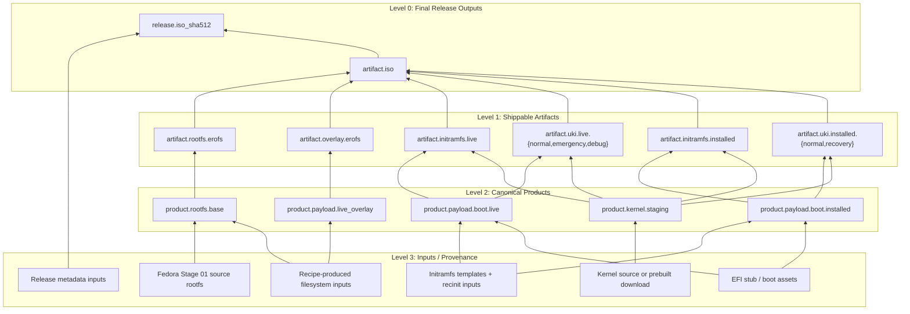

# 03 Filesystem-First Migration

Status: ready

## Purpose

Replace the current stage-numbered build model with a filesystem-first model.

The new canonical order is:

1. filesystem products
2. artifact transforms
3. release engineering
4. validation

The repo should stop treating stages as the architecture. Stages can remain as compatibility labels and test scenarios, but they should no longer be the canonical owners of composition.

## First-Principles Model

At the core, distro building is:

- collect files
- place files into the correct filesystem trees
- transform those trees into publishable artifacts
- verify the result

That means:

- the canonical build products are filesystem trees and derived filesystem images
- ISOs, disk images, UKIs, initramfs blobs, and release metadata are transforms of those products
- release engineering is the packaging/publishing layer on top, not the build model itself

## Recommended Dependency-Level Model

For clarity, the build graph should be explained with four visible levels.

- `Level 0`
  - final release outputs
- `Level 1`
  - shippable artifacts that directly make the final ISO
- `Level 2`
  - canonical composed products
- `Level 3`
  - acquired/generated inputs and provenance

This is a mental model for clarity, not a hardcoded implementation limit.
The real system is a dependency DAG, not a strict tree, and deeper inputs may
exist internally. But for planning and ownership, four visible levels are the
right default.

### Levitate Example

- `Level 0`
  - `artifact.iso`
  - `release.iso_sha512`
- `Level 1`
  - `artifact.rootfs.erofs`
  - `artifact.overlay.erofs`
  - `artifact.initramfs.live`
  - `artifact.uki.live.normal`
  - `artifact.uki.live.emergency`
  - `artifact.uki.live.debug`
  - `artifact.initramfs.installed`
  - `artifact.uki.installed.normal`
  - `artifact.uki.installed.recovery`
- `Level 2`
  - `product.rootfs.base`
  - `product.payload.live_overlay`
  - `product.payload.boot.live`
  - `product.payload.boot.installed`
  - `product.kernel.staging`
- `Level 3`
  - Fedora Stage 01 source rootfs
  - recipe-produced filesystem inputs
  - kernel source or prebuilt download
  - initramfs templates and recinit inputs
  - EFI stub and boot asset inputs
  - release metadata inputs

### Mermaid Graph

The key architectural rule is:

- levels describe dependency distance
- products own composition
- transforms own format conversion
- release outputs own publication metadata
- stage names, if kept, are compatibility or validation labels only

## What Release Engineering Means Here

Release engineering is **not** the whole distro builder.

It is the layer that:

- versions outputs
- names outputs
- computes hashes/manifests/signatures
- packages shipping artifacts
- publishes/promotes them

It should consume already-defined products. It should not be the place where core filesystem composition logic lives.

## Why This Track Exists

The current repo still mixes up three different things:

- composition units
- test milestones
- artifact owners

Stage numbers are currently used for all three, which is why the architecture feels wrong.

Examples of the current coupling:

- contracts are aggregated as `StageContract`
- builder workflows parse and route by stage numbers
- artifact directories and CLI commands are stage-owned
- install tests discover artifacts by stage path
- variant ownership still starts at `00Build.toml` and then fills later stages with placeholders

## What 03 Is

- a filesystem-product ownership migration
- an artifact-transform ownership migration
- a release-engineering boundary cleanup
- a test/scenario ownership migration

## What 03 Is Not

- not another Stage 01 source-media change
- not a bootc migration
- not a docs-only rename pass
- not "delete every stage module first"

## Current Repo Reality

The current stage model is still deeply real in active code:

- `distro-contract/src/schema.rs`
  - still defines `StageContract` as the aggregate contract owner
- `distro-contract/src/variant.rs`
  - still loads `00Build.toml` as the authoritative variant entrypoint and synthesizes later stage placeholders
- `distro-contract/src/validate.rs`
  - still validates the world as Stage 00-first, with deferred stage buckets
- `distro-builder/src/bin/workflows/parse.rs`
  - still parses `iso build <distro> <stage>`
- `distro-builder/src/bin/workflows/build.rs`
  - still builds by stage identity and stage roots
- `distro-builder/src/bin/workflows/artifacts.rs`
  - still prepares artifacts through `prepare-s00-build-inputs`, `prepare-s01-boot-inputs`, `prepare-s02-live-tools-inputs`
- `distro-builder/src/stages/s00_build.rs`
- `distro-builder/src/stages/s01_boot_inputs.rs`
- `distro-builder/src/stages/s02_live_tools_inputs.rs`
  - still encode composition as stage modules
- `distro-builder/src/pipeline/plan.rs`
  - already behaves somewhat like a producer system, but still emits stage-owned metadata
- `testing/install-tests/src/stages/mod.rs`
  - still runs and resolves artifacts through stage-numbered ownership
- `testing/install-tests/src/distro/*.rs`
  - still point at `s01-boot`, `s02-live-tools`, `s03-install`
- `xtask/src/cli/types.rs`
- `xtask/src/tasks/testing/scenarios.rs`
  - still expose stage-numbered boot/test workflow as the primary UX
- `justfile`
  - still teaches stage-numbered build/test routing

## Deep Investigation: Current Structural Blockers

The main blockers are not cosmetic. They are ownership bugs.

### 1. Stage is the canonical contract owner

- `distro-contract/src/schema.rs`
  - still defines `StageContract` as the real aggregate owner
  - still encodes artifact ownership through stage buckets
- `distro-contract/src/variant.rs`
  - still treats `00Build.toml` as the authoritative variant entrypoint
  - still synthesizes later-stage declarations with fake values such as `"ignored-in-stage_00-phase"`
- `distro-contract/src/validate.rs`
  - still validates the world as Stage 00-first with deferred stage buckets

### 2. Artifact identity is still stage-tagged

- `distro-builder/src/bin/workflows/build.rs`
  - still writes ISO outputs into stage-owned run roots
- `distro-builder/src/bin/workflows/artifacts.rs`
  - compatibility-scoped stage-tagged artifact names still exist in some older paths and fixtures
- `distro-builder/src/pipeline/io.rs`
  - still names overlays and rootfs-source pointers using stage tags
- `testing/install-tests/src/preflight.rs`
  - canonical preflight now resolves explicit artifact paths and release-product scope first
  - stage-tagged names remain only as compatibility discovery, not as rewritten contract truth
- `distro-contract/src/runtime.rs`
  - canonical runtime validation now consumes explicit artifact paths
  - the old stage-named runtime wrappers have been removed from the canonical surface

### 3. Builder execution is stage-first instead of product-first

- `distro-builder/src/bin/workflows/parse.rs`
  - still parses `iso build <distro> <stage>` as the primary model
- `distro-builder/src/bin/distro-builder.rs`
  - still teaches stage-numbered build surfaces as default usage
- `distro-builder/src/stages/s01_boot_inputs.rs`
- `distro-builder/src/stages/s02_live_tools_inputs.rs`
  - still encode composition as stage modules instead of product preparers

### 4. Test execution owns build-graph assumptions

- `testing/install-tests/src/stages/mod.rs`
  - still models progression as stage-gated artifact ownership
- `xtask/src/cli/types.rs`
- `xtask/src/tasks/testing/scenarios.rs`
  - still expose stage-numbered test workflow as primary UX

## Deep Investigation: Usable Core To Preserve

This track does not require throwing away everything.

### 1. The producer model is already the correct bridge

- `distro-builder/src/pipeline/plan.rs`
  - `ProducerPlan`
  - `RootfsProducer`
  - additive rootfs composition

This is already much closer to product ownership than the surrounding stage names suggest.

### 2. The transform layers already exist

- `distro-builder/src/bin/workflows/artifacts.rs`
  - rootfs/overlay EROFS transforms
- `distro-variants/_shared/00Build-build.sh`
  - live initramfs + ISO assembly
- `distro-builder/src/artifact/disk/mod.rs`
  - disk-image builder

These should be retargeted behind product/transform identities, not replaced.

### 3. The artifact families are already real

- `distro-spec/src/shared/rootfs.rs`
- `distro-spec/src/shared/overlayfs.rs`
- `distro-spec/src/shared/iso.rs`
- `distro-spec/src/shared/uki.rs`

The repo already knows what kinds of artifacts exist. The ownership model around them is what is wrong.

## Canonical Owners

- `distro-contract/src/schema.rs`
- `distro-contract/src/variant.rs`
- `distro-contract/src/validate.rs`
- `distro-contract/src/runtime.rs`
- `distro-builder/src/pipeline/plan.rs`
- `distro-builder/src/bin/workflows/parse.rs`
- `distro-builder/src/bin/workflows/build.rs`
- `distro-builder/src/bin/workflows/artifacts.rs`
- `distro-builder/src/bin/distro-builder.rs`
- `distro-builder/src/stages/*`
- `testing/install-tests/src/stages/mod.rs`
- `testing/install-tests/src/preflight.rs`
- `testing/install-tests/src/distro/*.rs`
- `xtask/src/cli/types.rs`
- `xtask/src/tasks/testing/scenarios.rs`
- `justfile`

## Replacement Architecture

The replacement model should be:

### 1. Filesystem Products

Canonical product types should be things like:

- source rootfs tree
- live rootfs tree
- installed rootfs tree
- runtime payload tree
- boot payload tree

These are the first-class owners of "what files exist and where".

### 2. Artifact Transforms

Transforms consume filesystem products and emit artifacts such as:

- EROFS images
- initramfs archives
- UKIs
- ISOs
- disk images

The transform layer should not redefine product ownership. It should convert canonical trees into shipping artifacts.

### 3. Release Engineering Outputs

Release engineering should consume transformed artifacts and emit:

- named release files
- manifests
- checksums
- signatures
- published release bundles

### 4. Validation Scenarios

Validation should consume products/artifacts and test scenarios like:

- live boot
- live tools
- install
- installed boot
- runtime verification

Those are scenarios, not the canonical build graph.

## Desired Code State

The target architecture is:

- `identity`
- `products`
- `transforms`
- `scenarios`
- `release`

### Contract Layer

`distro-contract` should canonically own:

- identity metadata
- product declarations
- transform declarations
- scenario declarations
- release declarations

`StageContract` should stop being the source of truth.

### Variant Layer

`distro-contract/src/variant.rs` should load product-oriented variant ownership first and derive any stage compatibility second.

The code should stop doing this:

- load `00Build.toml`
- synthesize fake later stages
- pretend a full staged contract exists

### Builder Layer

`distro-builder` should:

- materialize products
- transform artifacts
- assemble release outputs

Stage modules may survive only as wrappers around that flow.

### Test Layer

`testing/install-tests` and `xtask` should:

- consume explicit scenario inputs
- resolve explicit artifact identities
- stop using stage-tag rewriting as the canonical runtime model

### Output Layout

The recommended steady-state layout is:

- `.artifacts/out/<distro>/products/...`
- `.artifacts/out/<distro>/artifacts/...`
- `.artifacts/out/<distro>/releases/...`

The current `s00-build`, `s01-boot`, `s02-live-tools` paths may remain during migration, but only as compatibility wrappers.

## Hard Requirements For This Track

- filesystem products must become the primary ownership layer
- artifact transforms must be explicit and separate from filesystem composition
- release engineering must consume products instead of owning composition
- tests must consume products/scenarios, not stage-path assumptions
- stage numbers may survive only as compatibility labels or test names

## Phased Upgrade Path

### Phase 1. Add a shadow product contract

- [ ] Add product/transform/scenario/release contract types in `distro-contract/src/schema.rs`.
- [ ] Keep `StageContract` temporarily for compatibility.
- [ ] Do **not** change CLI or output layout yet.

Acceptance:

- the repo can represent filesystem-first ownership in memory without changing public commands

### Phase 2. Invert `variant.rs`

- [ ] Make `distro-contract/src/variant.rs` load the new product-oriented model first.
- [ ] Derive the old stage-shaped view from that new model, not the other way around.
- [ ] Remove fake `"ignored-in-stage_00-phase"` ownership from the canonical path.

Acceptance:

- the canonical in-memory contract is product-shaped
- stage-shaped data is compatibility output only

### Phase 3. Remove deferred stage buckets

- [ ] Replace:
  - `required_for_00build`
  - `deferred_to_01boot`
  - `deferred_to_02livetools`
  - `deferred_to_03install_plus`
- [ ] Model explicit artifact ownership and product/transform dependencies instead.
- [ ] Update `distro-contract/src/validate.rs` accordingly.

Acceptance:

- validators stop reasoning in Stage 00 deferred buckets
- artifact ownership is explicit and non-overlapping

### Phase 4. Retarget the producer pipeline

- [ ] Keep `ProducerPlan` and `RootfsProducer` in `distro-builder/src/pipeline/plan.rs`.
- [ ] Introduce canonical product preparers for:
  - base rootfs
  - live overlay
  - live boot payload
  - installed boot payload
  - kernel staging
- [ ] Reduce `distro-builder/src/stages/s01_boot_inputs.rs` and `distro-builder/src/stages/s02_live_tools_inputs.rs` to compatibility wrappers.

Acceptance:

- real filesystem composition is product-owned
- stage modules are wrappers, not canonical composition owners

### Phase 5. Split builder routing into products, transforms, and releases

- [x] Add product-first and transform-first routing in:
  - `distro-builder/src/bin/workflows/parse.rs`
  - `distro-builder/src/bin/workflows/build.rs`
  - `distro-builder/src/bin/workflows/artifacts.rs`
- [x] Keep `00Build/01Boot/02LiveTools` only as compatibility aliases during migration.
- [x] Stop teaching stage-numbered builds as the default path in `distro-builder`.

Implemented:

- canonical release surface is now:
  - `distro-builder release build iso ...`
  - `distro-builder release build-all iso ...`
- canonical product surface is now:
  - `distro-builder product prepare <product> <distro> <output_dir>`
- canonical transform surface is now:
  - `distro-builder transform build rootfs-erofs ...`
  - `distro-builder transform build overlayfs-erofs ...`
  - `distro-builder transform build product-erofs <prepared_product_dir>`
- legacy stage commands remain available only as compatibility aliases:
  - `iso build`
  - `iso build-all`
  - `artifact build-stage-erofs`
  - `artifact prepare-stage-inputs`
  - `artifact prepare-s00-build-inputs`
  - `artifact prepare-s01-boot-inputs`
  - `artifact prepare-s02-live-tools-inputs`

Acceptance:

- [x] the default explanation/help path is product/transform/release oriented
- [x] stage commands remain optional compatibility surfaces

### Phase 6. Move runtime validation off stage tags

- [x] Remove stage-tag rewriting from:
  - `testing/install-tests/src/preflight.rs`
  - `distro-contract/src/runtime.rs`
- [x] Replace `stage_artifact_tag`-based validation with explicit artifact identities and scenario manifests.

Implemented:

- `testing/install-tests/src/preflight.rs`
  - resolves actual runtime artifact paths on disk
  - prefers canonical product-native names
  - falls back to compatibility names only as path discovery
  - uses release run-manifest metadata to decide whether live-boot scenario validation applies
- `distro-contract/src/runtime.rs`
  - adds explicit-path validators for Stage 00/runtime and live-boot/runtime
  - keeps stage-tagged Stage 01 validation only as a compatibility wrapper over the explicit-path validator

Acceptance:

- [x] runtime validation does not need `s00` / `s01` / `s02` name rewriting
- [x] artifact names are resolved from explicit runtime layouts and release metadata, not rewritten contracts

### Phase 7. Convert install-tests from stage runner to scenario runner

- [x] Replace the canonical numeric-stage runner API in `testing/install-tests/src/stages/mod.rs`.
- [x] Introduce canonical scenario identities such as `build_preflight`, `live_boot`, `live_tools`, `install`, `installed_boot`, `automated_login`, and `runtime`.
- [x] Keep `00Build` / `01Boot` / `02LiveTools` / `03Install` / `04LoginGate` / `05Harness` / `06Runtime` only as CLI aliases at the outer boundary.
- [x] Replace `run_stage`, `run_stage_forced`, `run_up_to`, and `stage_name(...)` in `testing/install-tests/src/stages/mod.rs` with scenario-native runners and alias translation.
- [x] Replace `resolve_iso_target_for_stage(...)`, `stage_output_dir_for_stage(...)`, and `derive_stage_iso_filename(...)` in `testing/install-tests/src/stages/mod.rs` with explicit scenario artifact resolution driven by product/release metadata.
- [x] Make live scenario execution consume explicit ISO/runtime artifacts instead of deriving them from `s01-boot` / `s02-live-tools` directory names.
- [x] Replace persisted stage-number state in `testing/install-tests/src/stages/state.rs` with scenario identity plus concrete artifact/run identity.
- [x] Stop invalidating cached results by `runtime_iso_mtime_secs_by_stage`; invalidate by the resolved scenario artifact identity instead.
- [x] Replace `RuntimeStageRun`, `RuntimeStageRunManifest`, and `resolve_latest_stage03_runtime(...)` in `testing/install-tests/src/stages/mod.rs` with scenario-native installed-runtime ownership.
- [x] Stop treating `s03-install` as the canonical owner for disk and OVMF runtime artifacts in `testing/install-tests/src/stages/mod.rs` and `xtask/src/tasks/testing/scenarios.rs`.
- [x] Remove `default_iso_path()` as a canonical `DistroContext` contract in `testing/install-tests/src/distro/mod.rs`.
- [x] Replace per-distro hardcoded `s01-boot` ISO paths in:
  `testing/install-tests/src/distro/levitate.rs`,
  `testing/install-tests/src/distro/ralph.rs`,
  `testing/install-tests/src/distro/acorn.rs`,
  `testing/install-tests/src/distro/iuppiter.rs`.
- [x] Make `testing/install-tests/src/qemu/session.rs` consume explicitly resolved scenario artifacts instead of calling `ctx.default_iso_path()`.
- [x] Update `testing/install-tests/src/bin/stages.rs` so the internal semantics are scenario-first even if `--stage` remains as a compatibility flag.
- [x] Replace `xtask` stage-native testing/boot routing in:
  `xtask/src/cli/types.rs`,
  `xtask/src/app.rs`,
  `xtask/src/tasks/testing/scenarios.rs`.
- [x] Replace `StagesCmd` / `BootConfig { stage01_root, stage02_root, stage03_root, ... }` with scenario/product-aware resolution while keeping stage-number aliases only at the CLI edge.
- [x] Replace `resolve_stage_iso(...)` and `resolve_stage03_runtime(...)` in `xtask/src/tasks/testing/scenarios.rs` with scenario-native artifact/runtime resolvers.
- [x] Remove remaining deep stage-path heuristics such as the `s01-boot` / `s02-live-tools` fallback in `testing/install-tests/src/preflight.rs` once scenario metadata is fully authoritative.

Implemented:

- `testing/install-tests/src/stages/mod.rs`
  - adds canonical `ScenarioId`
  - runs scenarios directly and keeps stage numbers only as compatibility aliases
  - resolves live artifacts from release-product run metadata
  - writes installed-runtime outputs under `.artifacts/out/<distro>/scenarios/...`
- `testing/install-tests/src/stages/state.rs`
  - tracks scenario results by canonical scenario name
  - invalidates by resolved input fingerprint, not stage-numbered ISO mtimes
- `testing/install-tests/src/bin/stages.rs`
  - accepts `--scenario` / `--up-to-scenario`
  - keeps `--stage` / `--up-to` as compatibility aliases
- `xtask`
  - parses scenario targets and stage-number aliases
  - resolves boot/test artifacts from `install-tests` scenario helpers instead of hardcoded stage roots

Acceptance:

- [x] install tests no longer own the build graph
- [x] the canonical runner is keyed by scenario identity, not stage number
- [x] live scenarios resolve ISO/runtime artifacts from explicit product/release metadata
- [x] installed scenarios resolve disk/OVMF/runtime artifacts from explicit install-scenario outputs
- [x] `DistroContext` no longer encodes canonical stage-owned ISO paths
- [x] `xtask` testing/boot paths are scenario-native internally and use stage numbers only as aliases
- [x] no canonical logic below the alias boundary depends on `s01-boot`, `s02-live-tools`, `s03-install`, or numeric stage ids

### Phase 8. Clean names, paths, and compatibility shims

- [x] Isolate `distro-builder` compatibility stage metadata out of the canonical product owner.
  - owner files:
    - `distro-builder/src/bin/distro-builder.rs`
    - `distro-builder/src/bin/workflows/parse.rs`
  - remove `BuildStage` and `compatibility_stage` from the canonical model
  - keep stage aliases only in an explicit compatibility parser/adapter module

- [x] Make release execution fully product-native instead of stage-native under the hood.
  - owner file:
    - `distro-builder/src/bin/workflows/build.rs`
    - `distro-builder/src/bin/workflows/compat_release.rs`
  - stop driving release builds through `BUILD_STAGE_*`, `STAGE_*`, and `native_build_script`
  - stop deriving release ISO names from `s00_build` / `s00-build`
  - keep any stage shell hook invocation only behind an explicit compatibility boundary

- [x] Rename generic run/layout helpers so canonical code no longer uses `stage_*` names for product/scenario/release runs.
  - owner files:
    - `distro-builder/src/bin/stage_paths.rs`
    - `distro-builder/src/bin/stage_runs.rs`
    - `distro-builder/src/bin/stage_run_manifest.rs`
  - introduce neutral names for:
    - release/product/scenario output roots
    - run allocation and pruning
    - run manifest persistence
  - keep `stage_*` wrappers only if still needed for explicit compatibility

- [x] Move stage-only artifact commands out of the canonical artifact workflow owner.
  - owner file:
    - `distro-builder/src/bin/workflows/artifacts.rs`
  - canonical owner should expose only:
    - `product prepare ...`
    - `transform build ...`
    - release/product-native artifact naming
  - move:
    - `build-stage-erofs`
    - `prepare-stage-inputs`
    - `prepare-s00-build-inputs`
    - `prepare-s01-boot-inputs`
    - `prepare-s02-live-tools-inputs`
    into an explicit compatibility command module

- [x] Remove stage wrappers and stage metadata methods from the canonical scenario runner.
  - owner file:
    - `testing/install-tests/src/stages/mod.rs`
  - move out of the canonical scenario owner:
    - `compatibility_stage_name()`
    - `compatibility_stage_slug()`
    - `compatibility_stage_dirname()`
    - `compatibility_stage_number()`
    - `run_stage(...)`
    - `run_stage_forced(...)`
    - `run_up_to(...)`
  - keep them only in CLI/compatibility wrapper code

- [x] Remove compatibility metadata and filename fallbacks from canonical preflight.
  - owner file:
    - `testing/install-tests/src/preflight.rs`
  - stop using:
    - `compatibility_stage_slug`
    - stage-run manifest semantics
    - `-filesystem.erofs`, `-overlayfs.erofs`, `-live-rootfs-source.path` compatibility discovery
  - canonical preflight should validate product/scenario-native manifests and paths only
  - if stage fallbacks remain, move them into a wrapper path outside canonical preflight

- [x] Rename `xtask` testing ownership from `Stages` to scenarios, leaving `stages` only as an alias surface if still needed.
  - owner files:
    - `xtask/src/cli/types.rs`
    - `xtask/src/app.rs`
    - `xtask/src/tasks/testing/scenarios.rs`
  - canonical command/owner names should be scenario-based
  - `stages` may remain only as a CLI alias layer

- [x] Clean stage-shaped runtime/live payload names and markers where they are no longer intentionally user-facing compatibility.
  - owner files:
    - `distro-builder/src/pipeline/live_tools.rs`
    - `distro-builder/src/artifact/live_overlay.rs`
    - `testing/install-tests/src/distro/mod.rs`
    - `testing/install-tests/src/stages/mod.rs`
    - `xtask/src/tasks/testing/scenarios.rs`
  - audit and replace names such as:
    - `levitate-install-entrypoint`
    - `30-install-ux.sh`
    - `stage02-entrypoint-helper=*`
    - `stage02_install_experience()`
    - `Stage 01` / `Stage 02` in canonical diagnostics where scenario/product wording should now be authoritative
  - preserve compatibility names only when they are intentionally shipped UX or external interfaces

- [x] Remove stage-shaped metadata from canonical filesystem products.
  - owner file:
    - `distro-builder/src/pipeline/plan.rs`
  - replace `usr/lib/stage-manifest.json` with product-native metadata
  - stop branding canonical base product identity as `PRETTY_NAME="... (Stage 00Build)"`

- [x] Tighten output layout around canonical ownership.
  - owner files:
    - `distro-builder/src/bin/stage_paths.rs`
    - `testing/install-tests/src/stages/mod.rs`
    - `testing/install-tests/src/preflight.rs`
  - canonical layout should converge on:
    - `.artifacts/out/<distro>/products/...`
    - `.artifacts/out/<distro>/artifacts/...`
    - `.artifacts/out/<distro>/releases/...`
    - `.artifacts/out/<distro>/scenarios/...`
  - any remaining `s00-build`, `s01-boot`, `s02-live-tools`, `s03-install` layout must be wrapper-only

- [x] Update help text, docs, and wrappers last.
  - owner files:
    - `distro-builder/src/bin/distro-builder.rs`
    - `testing/install-tests/src/bin/stages.rs`
    - `xtask/src/cli/types.rs`
    - `justfile`
    - migration docs
  - after canonical naming and layout are fixed, reduce stage-first wording in:
    - usage/help text
    - examples
    - diagnostics
    - wrapper commands
  - keep stage aliases only where intentionally retained for operator compatibility

Acceptance:

- [x] stage labels are no longer the canonical ownership model anywhere
- [x] canonical builder execution no longer stores or routes through stage-native metadata
- [x] canonical test/preflight execution no longer consumes stage-native manifests or file names
- [x] canonical runtime/live payload names are product/scenario-native
- [x] any remaining stage surface is explicit compatibility only

### Phase 9. Legacy Placeholder

Superseded by [04_MIGRATION_RING_MODEL.md](04_MIGRATION_RING_MODEL.md).

Track 03 uncovered that the remaining work is not a pure naming purge.
The real remaining problem is mixed ownership against the ring model, so the old
Phase 9 concern now becomes Phase 1 of Track 04.

The historical checklist below is kept only as an audit note for what exposed the
problem, not as the active migration plan.

#### Historical Audit Note: Purge `stage` from the filetree and source vocabulary

Baseline measured on `2026-03-14` across active workspace roots (`distro-builder`, `distro-contract`, `distro-spec`, `testing`, `xtask`, `distro-variants`) excluding `.git`, `target`, `node_modules`, and `.artifacts`:

- literal `stage` substring occurrences in file contents: `2698`
- files containing at least one literal `stage` substring: `128`
- file or directory paths containing the literal `stage` substring: `37`

This phase is intentionally stricter than Phase 8:

- Phase 8 made `stage` non-canonical.
- Phase 9 removes the literal word `stage` from the active repo surface, especially the filetree.

Design:

- Treat Phase 9 as a controlled rename migration, not a grep-and-replace exercise.
  - every rename must preserve one canonical owner
  - no parallel `stage_*` and non-`stage_*` implementations may coexist in the default path
  - rename the owner, then update all imports/callers in the same change set

- Filetree-first is mandatory.
  - if the filetree still contains `stage`, developers will keep reintroducing it into code and docs
  - Phase 9 therefore starts with path/module/bin/script renames before broad identifier cleanup

- Compatibility must become role-based only.
  - allowed compatibility examples:
    - `base-rootfs`
    - `live-boot`
    - `live-tools`
    - `install`
    - `installed-boot`
    - `automated-login`
    - `runtime`
  - disallowed compatibility examples:
    - `stage`
    - `stages`
    - `00Build`
    - `01Boot`
    - `02LiveTools`
    - `03Install`
    - `04LoginGate`
    - `05Harness`
    - `06Runtime`
    - `s00`
    - `s01`
    - `s02`
    - `0`
    - `1`
    - `2`
    - `build-stage-erofs`
    - `prepare-stage-inputs`
    - `stage-window`
  - if an old interface must survive temporarily, it must survive under a role alias only, not a numeric alias and not a literal-`stage` alias

- Scope is two-ringed:
  - Ring A: active implementation roots
    - `distro-builder`
    - `distro-contract`
    - `distro-spec`
    - `testing`
    - `xtask`
    - `distro-variants`
  - Ring B: full tracked repo cleanup
    - root docs
    - `checkpoints.md`
    - `.teams/`
    - helper scripts and repo notes
  - completion for Phase 9 requires Ring A to be zero first, then Ring B to be zero

- Historical notes do not get a naming exemption.
  - if tracked docs still contain the literal word `stage`, they must either:
    - be rewritten to the new vocabulary, or
    - be moved out of the tracked repository
  - moving them into a tracked `archive/stage-*` path is not acceptable because the filetree would still contain the forbidden word

- Naming model for the final repo:
  - `product`
  - `transform`
  - `release`
  - `scenario`
  - `source`
  - `run`
  - `compat`
  - `input`
  - `output`
  - these replace `stage` everywhere in:
    - paths
    - module names
    - bin names
    - function names
    - diagnostics
    - docs
  - they also replace numbered stage artifact families such as:
    - `00Build.toml` -> `build.toml`
    - `01Boot.toml` -> `boot.toml` or `boot-source.toml`
    - `02LiveTools.toml` -> `live-tools.toml`
    - `00Build-build.sh` -> `build-release.sh`
    - `01Boot-build.sh` -> `boot-release.sh`
    - `02LiveTools-build.sh` -> `live-tools-release.sh`
    - `00Build-build-capability.sh` -> `build-capability.sh`

- Rename order is fixed:
  1. filetree and module paths
  2. recipe/source filenames
  3. public CLI/bin/wrapper names
  4. identifiers and diagnostics
  5. docs and historical notes
  6. full-repo zero-match measurement

- Measurement is an enforced gate, not a vanity metric.
  - every sub-phase ends with a repo scan
  - any newly added `stage` occurrence is a regression
  - Phase 9 is complete only when scans hit zero for both:
    - path names
    - file contents

- This phase should be executed in several small rename batches.
  - one path family at a time
  - one compatibility surface at a time
  - verify build/test/CLI after each batch
  - do not attempt a single monolithic repository-wide rename

Recommended batch order:

1. variant manifest and script family
   - `00Build.toml`, `01Boot.toml`, `02LiveTools.toml`
   - `00Build-build.sh`, `01Boot-build.sh`, `02LiveTools-build.sh`
   - `00Build-build-capability.sh`
   - replace with role-based manifest/script names before deeper module cleanup
2. `distro-builder/src/bin/stage_*` and `distro-builder/src/stage_runs.rs`
   - rename to neutral run/manifest/path names
3. `distro-builder/src/stages/` and `testing/install-tests/src/stages/`
   - rename directories/modules to `compat` / `scenarios` / `inputs`
4. `testing/install-tests/src/bin/stages.rs`, `xtask`, and `justfile` wrapper names
   - remove both literal-`stage` names and numeric stage aliases from the default UX
5. `distro-builder/recipes/*stage01*` and `distro-builder/src/recipe/*stage01*`
   - replace Stage 01 naming with source-role naming
6. `testing/install-tests/test-scripts/stage-*.sh`
   - rename scripts and their callers
7. top-level/docs/history sweep
   - `checkpoints.md`
   - `.teams/`
   - root docs and migration docs

- [ ] Remove `stage` from active file and directory names first.
  - owner paths:
    - `distro-variants/*/00Build.toml`
    - `distro-variants/*/01Boot.toml`
    - `distro-variants/*/02LiveTools.toml`
    - `distro-variants/*/00Build-build.sh`
    - `distro-variants/*/01Boot-build.sh`
    - `distro-variants/*/02LiveTools-build.sh`
    - `distro-variants/*/00Build-build-capability.sh`
    - `distro-builder/src/bin/stage_paths.rs`
    - `distro-builder/src/bin/stage_run_manifest.rs`
    - `distro-builder/src/bin/stage_runs.rs`
    - `distro-builder/src/stage_runs.rs`
    - `distro-builder/src/stages/`
    - `distro-builder/install-split-pane/`
    - `testing/install-tests/src/bin/stages.rs`
    - `testing/install-tests/src/stages/`
    - `testing/install-tests/test-scripts/stage-*.sh`
    - `distro-builder/docs/03_MIGRATION_STAGELESS.md`
  - required model:
    - replace numbered stage path owners with role-based names such as:
      - `build.toml`
      - `boot.toml`
      - `live-tools.toml`
      - `build-release.sh`
      - `boot-release.sh`
      - `live-tools-release.sh`
      - `build-capability.sh`
    - replace `stage_*` path owners with neutral names such as:
      - `run_paths`
      - `run_manifest`
      - `run_store`
      - `scenario_compat`
      - `install-split-pane`
      - `scenarios`
    - update all internal module declarations, imports, bin targets, and wrapper references in the same change sets

- [ ] Remove `stage` from recipe and source-owner filenames.
  - owner paths:
    - `distro-builder/recipes/stage01-dvd-deps.rhai`
    - `distro-builder/recipes/fedora-stage01-rootfs.rhai`
    - `distro-builder/recipes/alpine-stage01-rootfs.rhai`
    - `distro-builder/recipes/custom-stage01-rootfs.rhai`
    - `distro-builder/recipes/alpine-preseed-stage01-assets.rhai`
    - `distro-builder/src/recipe/stage01_source.rs`
    - `distro-builder/src/recipe/alpine_stage01.rs`
  - required model:
    - replace Stage 01 naming with source-role naming, for example:
      - `dvd-source-deps`
      - `fedora-dvd-source-rootfs`
      - `alpine-live-source-rootfs`
      - `source_rootfs`
    - keep source-acquisition meaning, but stop encoding `stage` into filenames

- [ ] Remove `stage` from code identifiers, functions, and diagnostics in active owners.
  - owner files:
    - `distro-contract/src/runtime.rs`
    - `distro-contract/src/validate.rs`
    - `distro-contract/src/variant.rs`
    - `distro-spec/src/conformance.rs`
    - `distro-builder/src/bin/workflows/*.rs`
    - `testing/install-tests/src/preflight.rs`
    - `testing/install-tests/src/scenarios/*.rs` after filetree rename
    - `xtask/src/tasks/testing/scenarios.rs`
  - required model:
    - replace identifiers such as:
      - `stage_required_kernel_cmdline`
      - `stage_output_dir`
      - `stage_root`
      - `stage_artifact_tag`
      - `Stage00.*`, `Stage01.*` diagnostics
    - use:
      - `scenario_*`
      - `run_*`
      - `product_*`
      - `release_*`
      - `source_*`

- [ ] Remove `stage` from operator surfaces and wrapper names.
  - owner files:
    - `justfile`
    - `distro-builder/src/bin/distro-builder.rs`
    - `xtask/src/cli/types.rs`
    - `testing/install-tests/src/bin/scenarios.rs` after rename
    - migration docs and READMEs
  - required model:
    - canonical commands/examples must prefer:
      - `scenario`
      - `product`
      - `release`
      - `source`
    - remove numbered stage aliases from the default visible path too
    - any retained compatibility aliases must not keep either:
      - the literal word `stage`
      - numbered stage artifact names like `00Build`, `01Boot`, `02LiveTools`

- [ ] Remove `stage` from docs and migration filenames.
  - owner paths:
    - `distro-builder/docs/03_MIGRATION_STAGELESS.md`
    - `checkpoints.md`
    - team/docs notes under `.teams/` that still carry active references
  - required model:
    - rename the Track 03 document itself to a neutral title such as filesystem-first or product-model migration
    - update `00_MIGRATION_INDEX.md` and any inbound links in the same change set

- [ ] Re-measure and drive the literal `stage` count to zero in active workspace roots first, then the full tracked repository.
  - required checks:
    - Ring A:
      - zero file or directory paths containing `stage`
      - zero literal `stage` substrings in active code/docs under:
        - `distro-builder`
        - `distro-contract`
        - `distro-spec`
        - `testing`
        - `xtask`
        - `distro-variants`
    - Ring B:
      - zero file or directory paths containing `stage` anywhere in the tracked repo
      - zero literal `stage` substrings anywhere in tracked repo contents
-  - if any historical/archive material must keep the old word temporarily, move it out of the active roots before calling this phase complete
  - if any historical/archive material must keep the old word temporarily, Phase 9 is not complete yet

Acceptance:

- [ ] no tracked file or directory path contains the literal substring `stage`
- [ ] no tracked file or directory path contains stage-artifact numbering such as `00Build`, `01Boot`, `02LiveTools`, `s00`, `s01`, or `s02`
- [ ] no active code identifier or diagnostic contains the literal substring `stage`
- [ ] no canonical or compatibility command/help/doc surface uses:
  - the literal substring `stage`
  - numbered stage artifact names or numeric stage aliases
- [ ] source/rootfs/release/scenario naming is role-based instead of stage-based everywhere
- [ ] a repo-wide measured rescan returns zero literal `stage` matches

## What Must Die

- fake later-stage placeholders in `distro-contract/src/variant.rs`
- deferred stage ownership buckets in `distro-contract/src/schema.rs`
- stage-tag artifact rewriting in `testing/install-tests/src/preflight.rs`
- stage-owned runtime validation in `distro-contract/src/runtime.rs`

## What Must Survive

- additive producer composition in `distro-builder/src/pipeline/plan.rs`
- explicit transform layers for EROFS, initramfs, UKI, ISO, and disk images
- recipe ownership of source/package knowledge
- the current A/B runtime/update model
- stage names only as compatibility/test vocabulary

## Recommended First Change Set

The first implementation PR for this track should do only this:

- add product-oriented contract types in `distro-contract/src/schema.rs`
- make `distro-contract/src/variant.rs` load product ownership canonically
- derive the old stage model as compatibility output
- leave builder CLI/test UX untouched for that first cut

That is the least risky first step because it flips the source of truth before changing routing or artifact paths.

## Definition Of Done

This track is complete only when:

- the repo's canonical ownership is filesystem-first and product-oriented
- artifact transforms are explicit and separate from composition
- release engineering consumes products rather than acting as the build model
- builder execution no longer requires stage-numbered composition as the default path
- install tests consume product/scenario inputs instead of stage-path lookups
- stage-numbered commands survive only as explicit compatibility shims or are removed entirely

## Immediate Start Point

Start in `distro-contract`, not in CLI aliases and not in doc renames.

The first concrete action should be:

- define filesystem-product contract types in `distro-contract/src/schema.rs`, then make `distro-contract/src/variant.rs` load real product ownership instead of synthesizing later stage placeholders from a Stage 00-first manifest.
